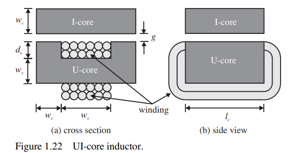
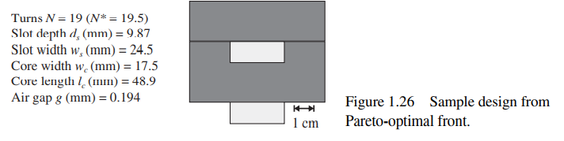

# 1.10 Genetic algorithm optimization for inductor design with pymoo

Inspired from book "Power Magnetic Devices:A Multi-Objective Design" Approach by S.D. Sudhoff

## Introduction

In this section, we will endeavor to design a UI-core inductor using an optimization based design process.More in particular we will use the NSGA-II with constrains.

It should be observed that the analysis used to derive the needed relationships is very simplistic, but this does not matter because our purpose here is only to look at the design process. We will conduct a much more detailed analysis and design in subsequent chapters. 


A UI-core inductor is depicted in Figure 1.22. Therein, the dark region is the magnetic core. The magnetic core conducts magnetic flux and is made of a Ushaped piece (the U-core) and an I-shaped piece (the I-core). Conductors (wires) pass through the middle of the U, a region called the slot, and also around the outside of the U-core to form a winding.

The slot has a width denoted $w_s$ and a height denoted $d_s$. The width of the core (both U- and I-cores) is denoted the core width $w_c$, and the length of the core pieces is $l_c$. The two cores are separated by an airgap $g$.

The cross-sectional drawing (a) is the view that one would obtain by looking to the right from the left side of the side view (b) if the side view were cut in half (in the direction into the page). The light region indicates a winding comprised of $N$ turns of wire. Our goal in this design will be to design an inductor that has an inductance of at least $L_{mn}$, a flux density below $B_{mx}$, and a current density below $J_{mx}$ at rated dc current $i_{rt}$. It is desirable to minimize the mass $M$ of the inductor and to minimize the power loss at rated current, denoted $P_{rt}$. We will also constrain our designs to have a mass below $M_{mx}$ and a power loss less than $P_{mx}$.

The free parameters in our design are the number of turns $N$, the slot depth $d_s$, the slot width $w_s$, the core thickness $w_c$, the core depth $l_c$, and the air gap $g$. Thus, our parameter vector may be expressed as:
$$
x = [N^*, d_s, w_s,w_c,l_c,g] 
$$
In (1.10-1), N* is the desired number of turns rather than the actual number of turns $N$ because, as a design parameter, we will let the number of turns be represented as a real number rather than an integer. This is because for large $N$ this variable acts in a more continuous rather than discrete fashion. The actual number of turns is calculated from the desired number as

$$
N=round(N^*)
$$

In order to perform the optimization, we will need to analyze the device. It is
assumed that windings occupy the entire slot, that the core is infinitely permeable, and
that the fringing and leakage flux components are negligible.

With these assumptions, the mass of the design may be expressed as
$$
M = 2(2w_c + w_s + ds)l_c w_c \rho_{mc} + (2l_c + 2w_c + \pi d_s)d_s w_s k_{pf} \rho_{wc}
$$

In (1.10-3), $\rho_{mc}$ and $\rho_{wc}$ denote the mass density of the magnetic core and wire conductor, respectively, and $k_{pf}$ is the fraction of the U-core window occupied by conductor. Ideally, it would be 1, but 0.7 is a very high number in practice. 

The next step is the computation of loss. The power dissipation of the winding at rated current may be expressed as

$$
P_{rt} = \frac{(2l_c + 2w_c + \pi d_s) N^2 i_{rt}^2}{d_s w_s k_{pf} \sigma_{wc}}
$$

In (1.10-4), $\sigma_{wc}$ denotes the conductivity of the wire conductor. There are constraints on the inductance, flux density at rated current, and current density at rated current. These quantities may be expressed as

$$
L = \frac{\mu_0 l_c w_c N^2}{2 g}
$$

$$
B_{rt} = \frac{\mu_0 N i_rt}{2 g}
$$

$$
J_{rt} = \frac{N i}{d_s w_s k_{pf}}
$$

For the multi-objective optimization, the fitness function will be taken as the generic multi-objective optimization, with several objective functions with subject to inequality and equality constraints to optimize [18]. The goal is to find a set of solutions that do not have any constraint violation and are as good as possible regarding all its objectives values. The problem definition in its general form is given by:

$$
\min \quad f_{m}(x) \quad \quad \quad \quad m = 1,..,M  \\
\text{s.t.}   \quad g_{j}(x) \leq 0  \quad \; \; \,  \quad j = 1,..,J \\
\quad x_{i}^{L} \leq x_{i} \leq x_{i}^{U}  \quad i = 1,..,N \\
$$

The formulation above defines a multi-objective optimization problem with $N$ variables, $M$ objectives, $J$ inequality. Moreover, for each variable $x_i$ lower and upper variable boundaries ($x_{i}^{L}$ and $x_{i}^{U}$) are defined.

More in detail in this code design:
1. the minimized fitness function are 2: losses and mass
```
    # optimization fitness functions
    f1 = M
    f2 = Prt
```
2. the constrains are defined by design space on the optimized variables. 
```
    # setup design space
    #               N   ds   ws   wc   lc   g
    GAP = Struct()
    GAP.gd_min = np.array([1,  1e-3, 1e-3, 1e-3, 1e-3, 1e-5])
    GAP.gd_max = np.array([1e3, 1e-1, 1e-1, 1e-1, 1e-1, 1e-2])
```
3. and from the constrain on the calculated parameters
```
    # optimization constrains
    # energy metric constraint
    g1 = D.Lmn - L
    # flux density constraint
    g2 = Brt - D.Bmx
    # current density constraint
    g3 = Jrt - D.Jmx
    # power loss constraint
    g4 = Prt - D.Pmx
    # mass constraint
    g5 = M-D.Mmx
```

For our design, let us consider a ferrite material for the core with $B_{mx} = 0.617 T$ and $\rho_{mc} = 4680 kg/m^3$, and consider copper for the wire with $\rho_{wc} = 8890 kg/m^3$ and $J_{mx} = 7.5 A/mm^2$. 

We will take rated current to be 10 A and take the minimum inductance $L_{mn} = 1 mH$. Finally, let us take the maximum allowed mass as $M_{mx} = 1 kg$ and take the maximum allowed loss to be $P_{mx} = 1 W$

The next step in the design process is to determine the parameter space $\Omega$. This is tabulated in Table 1.7. Some level of engineering estimation is required to select a reasonable range. However, situations where a range is incorrectly set are usually easy to detect by looking at the population distribution


A sample design on the front is also indicated; this design is illustrated in more detail in Figure 1.26. The sample design has a mass of 0.75 kg and a loss at rated current of 0.67 W. The inductance is just over 1 mH, and flux density at rated current is 0.617 T. The current density at rated current is 1.3 A/mm2.


## What's next?
1. Include the AC losses with Ferreira model (for example).
2. Include thermal modeling for thermal limitation.
3. Include waveform in time domain to model AC inductor for resonant converters.

## References
[1] https://www.amazon.it/Power-Magnetic-Devices-Multi-Objective-Approach/dp/1118489993
[2] http://pymoo.org/getting_started.html
[18] Kalyanmoy Deb and Deb Kalyanmoy. Multi-Objective Optimization Using Evolutionary Algorithms. John Wiley & Sons, Inc., New York, NY, USA, 2001. ISBN 047187339X.